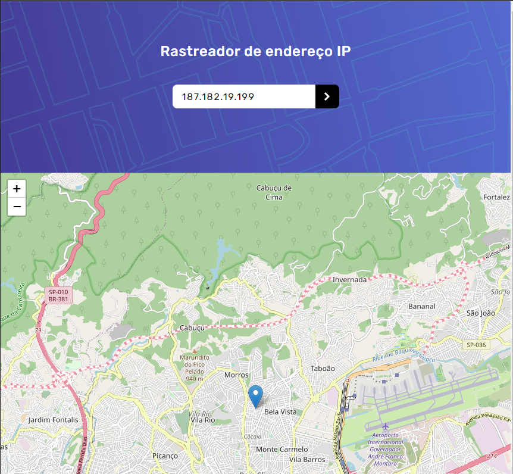

# Frontend Mentor - Solução para o Rastreador de Endereço IP

Esta é uma solução para o [desafio de rastreamento de endereço IP do Frontend Mentor](https://www.frontendmentor.io/challenges/ip-address-tracker-I8-0yYAH0). Os desafios do Frontend Mentor ajudam você a melhorar suas habilidades de codificação através da construção de projetos realistas.

## Índice

- [Visão Geral](#visão-geral)
  - [O Desafio](#o-desafio)
  - [Captura de Tela](#captura-de-tela)
  - [Links](#links)
- [Meu Processo](#meu-processo)
  - [Construído com](#construído-com)
- [Autor](#autor)

## Visão Geral

### O Desafio

Os usuários devem ser capazes de:

- Ver o layout ideal para cada página dependendo do tamanho da tela do dispositivo.
- Ver os estados de foco para todos os elementos interativos na página.
- Ver seu próprio endereço IP no mapa no carregamento inicial da página.

### Captura de Tela

### Links

- URL da Solução: [Adicione o URL da Solução aqui](https://your-solution-url.com)
- URL do Site Ativo: [Adicione o URL do Site Ativo aqui](https://your-live-site-url.com)

## Meu Processo

### Construído com

- Marcação HTML5 Semântica
- Propriedades Personalizadas CSS
- [Tailwind CSS](https://tailwindcss.com/) - Estrutura CSS de Código Aberto
- [React](https://reactjs.org/) - Biblioteca JavaScript
- [Typescript](https://www.typescriptlang.org/) - Typescript

## Autor

- Mentor de Frontend - [@Guivieirasilva](https://www.frontendmentor.io/profile/Guivieirasilva)
- LinkedIn - [Guilherme Vieira](https://www.linkedin.com/in/guilherme-vieira-silva/)
- GitHub - [Guivieirasilva](https://github.com/Guivieirasilva)
